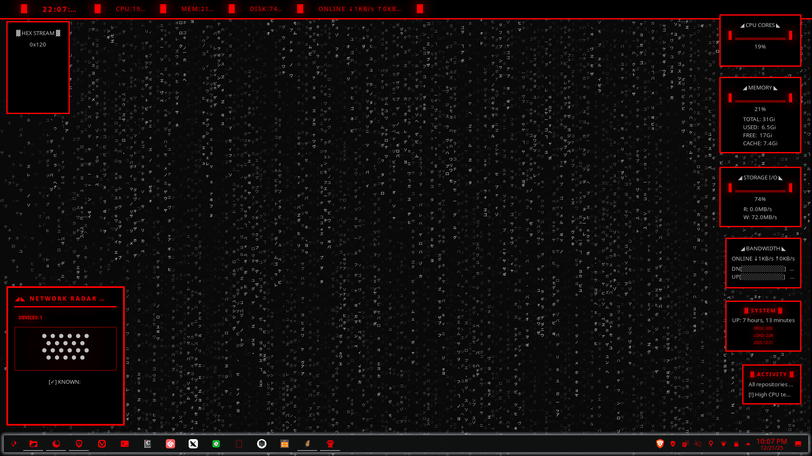

# voidrane-eww-dashboard

### ◢ overview ◣

a rather bare bones, minimalist, somewhat animated system dashboard built with eww (elkowar's wacky widgets). designed with a red-line "netrunner" aesthetic, featuring real-time system monitoring, notification daemon, auto startup, and network radar.

### ◢ features ◣

* **hex stream**: real-time system entropy and memory data converted to a falling matrix-style hex rain.
* **cpu monitor**: a 500ms refresh-rate graph tracking processor load history.
* **network radar**: active scan of local devices with a visual "sweep" animation.
* **marquee status bar**: top-level telemetry showing time, load, and network health.
* **resource modules**: dedicated tracking for memory, storage i/o, and system uptime.

### ◢ requirements ◣

* **eww**: (wayland or x11 version)
* **bash**: for logic scripts
* **font**: fira code or jetbrains mono (for monospace alignment)
* **tools**: `ps`, `awk`, `free`, `iproute2`

### ◢ installation ◣

1. clone the repository to your eww configuration folder:
```bash
git clone https://github.com/yourusername/cyberpunk-eww ~/.config/eww

```


2. ensure all scripts are executable:
```bash
chmod +x ~/.config/eww/scripts/*.sh

```


3. launch the dashboard:
```bash
eww open-many marquee_bar cpu_widget mem_widget disk_widget net_widget sysinfo_widget activity_widget radar_widget code_rain_left

```


### ◢ structure ◣

* `eww.yuck`: widget definitions and layout.
* `eww.scss`: cyberpunk styling, glow effects, and animations.
* `scripts/`: backend logic for data collection and streams.

* 

### ◢ disclaimer ◣

this dashboard is designed for high visual impact. frequent polling (500ms) may cause slight cpu overhead on older systems. adjust intervals in `eww.yuck` if needed.

---

**shoutout to dinkii for showing me the glory of eww, heres to many more and way cooler configs in the future. <3**
